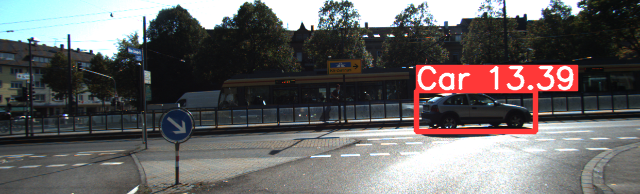

# Object Detection with Depth Estimation

This project develops a cost-effective and lightweight framework for object detection and depth estimation using a single camera. By integrating YOLOv5 for object detection and a custom neural network for distance estimation, the system achieves robust real-time performance. This approach eliminates the need for expensive multi-sensor setups like LiDAR, making it ideal for low-cost autonomous systems.

---

## 🚀 Overview

- **Framework**: Combines YOLOv5 for object detection and a Multi-Layer Perceptron (MLP) for distance estimation.
- **Dataset**: Trained on the KITTI dataset, a benchmark for autonomous driving research.
- **Purpose**: Enhances low-cost autonomous systems, robotics, and surveillance solutions with scalable and real-time perception capabilities.

---

## ✨ Key Features and Contributions

- Seamless integration of object detection and depth estimation into a single-camera setup.
- Enhanced performance in challenging conditions through training with augmented datasets simulating fog and rain.
- Adaptation of YOLOv5 to display both object classes and distances on bounding boxes.
- Real-time processing capabilities suitable for dynamic environments.

---

## 🛠️ Technical Approach

### Object Detection
- Utilizes the YOLOv5 model to identify objects and provide bounding box coordinates and class predictions.
- Offers fast and accurate detection critical for autonomous navigation.

### Distance Estimation
- A custom MLP neural network predicts object distances using bounding box coordinates as input.
- The network features:
  - Five fully connected layers with batch normalization and dropout.
  - ReLU activation for efficient non-linear mapping.

### Environmental Robustness
- Trained on augmented datasets with added noise and blur to simulate challenging conditions like fog and low light.
- Demonstrates strong robustness against adverse weather in real-world applications.

---

## 🌟 Results
### Visualization Example:
Below is an example image of the system output, showing object detection with bounding boxes and depth estimation:

---

## 🌟 Potential Applications

- **Autonomous Vehicles**: Safe navigation and obstacle avoidance.
- **Robotics**: Efficient perception in resource-constrained environments.
- **Surveillance Systems**: Reliable operation under diverse weather conditions.

---

## 👨‍💻 Contributors
- **Jagadeswara Pavan Kumar Varma Pothuri**  
- **Arnav Mahapatra**  

---

## 🔗 Additional Resources

- [KITTI Dataset](http://www.cvlibs.net/datasets/kitti/)
- [YOLOv5 Repository](https://github.com/ultralytics/yolov5)

---

This framework demonstrates how a simple yet effective design can address complex perception challenges, paving the way for scalable and cost-efficient solutions in robotics and autonomous systems.
